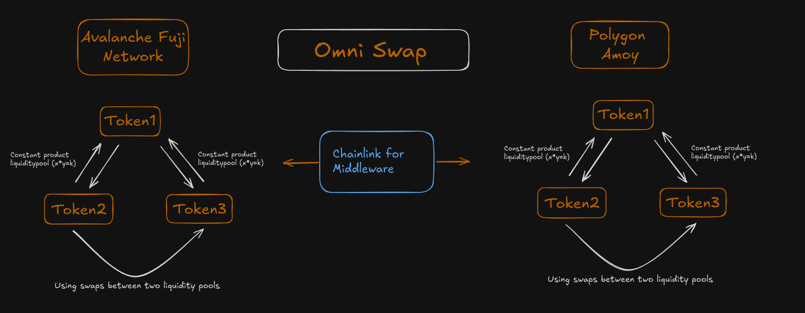
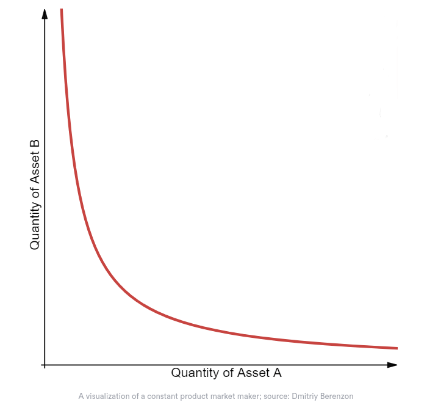
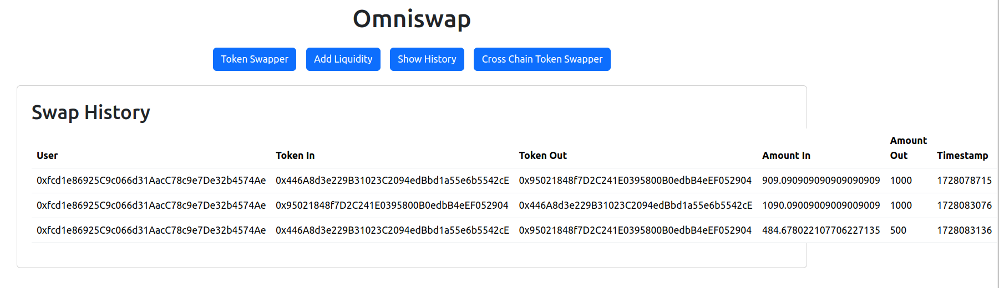
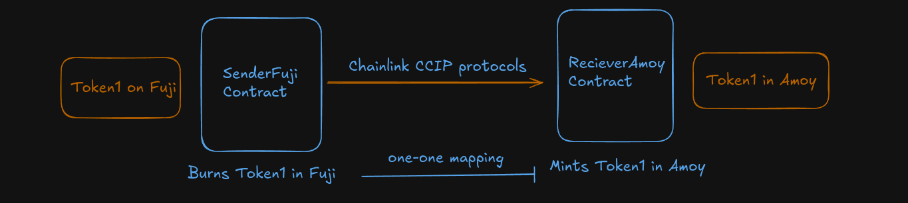

# OMNI-SWAP

Omniswap is a cross and in-chain DeX platform, deriving its core functionality from concepts similar to Coinswap and Chainlink. It currently has a liquidity pool of two tokens on both the Amoy and Fuji testnets. For cross-chain swaps, it operates with Token1 and Token2 on both chains, where each token corresponds to its counterpart on the opposite chain.

<p align="center">
  
</p>

## How to Use

To launch the app on `localhost:3000`, use the following command at the root:

```bash
npm start dev
```

For swapping purposes, you can directly contact me for the tokens used for swapping, but you can also extend the amount of tokens it can swap for the cross-platform solution to your own custom ERC20 Token.

For creating your own ERC20 token and testing this, you can look at the Token contract format at `contract-backend/ethereum/Tokenswapper.sol` and launch a similar token. After that, you would have to give ownership to both `RecieverAmoy` as well as `RecieverFuji`, so that they can mint that token and add the corresponding mapping between the chains using the `addMapping` function in the Receiver contracts.

# Single Chain Solution

For single-chain swapping, the contract follows `contract_backend/ethereum/contracts/TokenSwapper.sol`, which is based on constant product liquidity, where:

`x * y = k` (constant representing liquidity)

<p align="center">
  
</p>

The contracts are deployed as follows:

- **Fujitestnet**:
  - Token1: `0x95021848f7D2C241E0395800B0edbB4eEF052904`
  - Token2: `0x446A8d3e229B31023C2094edBbd1a55e6b5542cE`
  - TokenSwapper: `0x5f8CC5591a446f44C6FbA222D03002B92E97141D`

- **Amoytestnet**:
  - Token1: `0xae508A061eb0CFd8Fd203cDBc1d55AE8Ad4d9Ae2`
  - Token2: `0x24C7e8dC3fF972Ad2c90A17679Fbbe9108cD1B85`
  - TokenSwapper: `0xf7401A95FE23a478504F9d03eaE4A54E1ba139Ef`

The history feature is implemented for single-chain swaps and can be viewed via the "Show History" button. The data is stored in the form of an array of structs in the blockchain.

<p align="center">
  
</p>

```solidity
struct Swap {
    address user;
    address tokenIn;
    address tokenOut;
    uint256 amountIn;
    uint256 amountOut;
    uint256 timestamp;
}

```

Testing is done locally via Mocha (`/contract-backend/test`) as well as on Remix.

# Cross-Chain Solution

For the cross-chain solution, I modified the message sender and receiver contracts based on Chainlink's CCIP documentation ([Chainlink CCIP Docs](https://docs.chain.link/ccip/getting-started)). These contracts are wrapped by two additional contracts on either side of the chains, i.e., the sender and receiver contracts. For a better understanding, refer to the diagram below:

<p align="center">
  
</p>

### Deployment Addresses for Cross-Chain Contracts:

- **ReceiverFuji**: `0x93F0504eab11a17583EEC24f9c5D040Fc28E0E7d` (on Fuji)
- **ReceiverAmoy**: `0xCf56D51E7B84944B11C6287c701315a813e98E1D` (on Amoy)
- **SenderAmoy**: `0xdEDF80E71b110A49abFd3e2c64E73A6704E3EeB9` (on Amoy)
- **SenderFuji**: `0x59130507D2CD54f5e51a115A698d07e1d7957fe9` (on Fuji)

# Challenges

1. **Cross-Chain Token Testing & Deployment**: One of the main challenges was testing and deploying the cross-chain tokens. The message token was complex, and building on top of it without breaking its functionality proved to be challenging.

2. **Contract Testing and Deployment**: Cross-chain testing was done via Remix, which required deploying sender and receiver contracts. Even the smallest mistake required redeploying all contracts, leading to time-consuming processes.

3. **Message Parsing**: Messages were passed from the sender contract on one chain to the receiver contract on another in the form of a string: `{receiverAddress}${tokenAddress}${amount}`. This string needed to be parsed into three parts: converting the first two segments into addresses and the last segment into a `uint256` for the token amount. This required some research to implement correctly.

# Future Improvements

1. **Security**: The current method of cross-chain token swapping built on top of message passing may not be the most secure approach and could have some limitations.

2. **App Integration**: The single-chain TokenSwapper has been deployed on the Amoy testnet but has not yet been integrated into the app due to time constraints.

3. **Token Options**: Expanding the range of supported tokens would improve the scalability and flexibility of the solution.

# Video Explanation

You can watch a video explanation of the app here (the history feature was not covered): [Video Link](https://drive.google.com/file/d/1FfF02mefjOeSeX5m74ddFKRuYkSRVgRV/view?usp=sharing)


